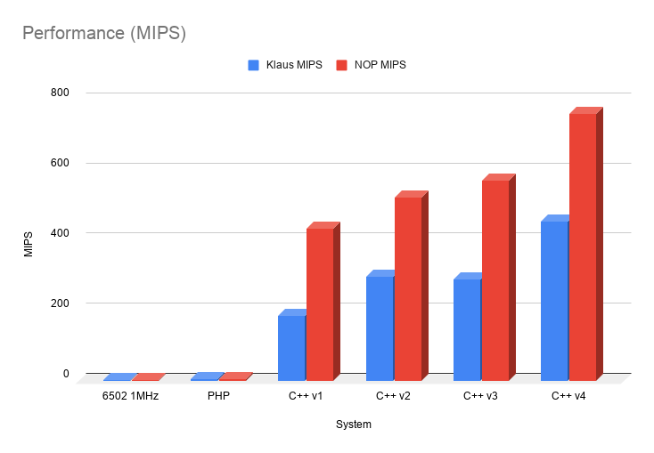
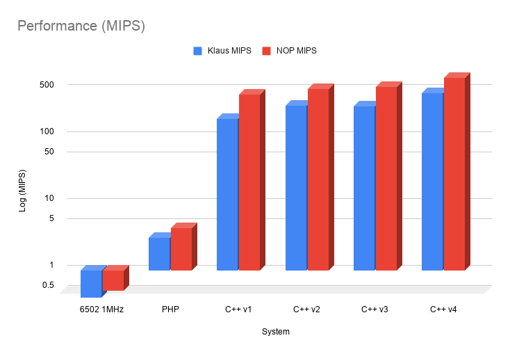

```
             | | | | | | | | | | | |
           +=^=^=^=^=^=^=^=^=^=^=^=^=+
           |  ┏━╸┏━┓┏━╸┏━┓┏━┓┏━┓┏━┓  |
           |  ┃  ┣━┓┗━┓┃┃┃┏━┛┣━┛┣━┛ C|
           |  ┗━╸┗━┛┗━┛┗━┛┗━╸╹  ╹    |
           +=v=v=v=v=v=v=v=v=v=v=v=v=+
             | | | | | | | | | | | |

            SixPhphive02 Goes Native!
```
# C6502PP
### The most unnecessary port of the world's least sensible 6502 emulator!

## What
A C++ implementation of [SixPhphive02](https://github.com/0xABADCAFE/sixphphive02)

- Compile Time Abstracted.
- Uses _templates_ and _concepts_ in place of runtime polymorphism and interfaces.
- Reaches hundreds of MIPS on modern hardware, depending on interpreter configuration and workload.

## Why?
Mainly a nerdsnipe, but also an excuse to play with a hypergolic mix of C++20 concepts and low-level dirty GCC-isms. You might be able to use the code in an emulator, but it does not yet have cycle exactness or support the set of known illegal opcodes. On the flip side, the emulation code is entirely header based and therefore should be simple to integrate.

## Building
You'll need a recentish GCC version, I have only tested with 11.4. I only write the most basic makefiles, so I asked Gemini to write this one.

```bash
:~/$ git clone https://github.com/0xABADCAFE/C6502PP.git

:~/$ cd C6502PP/src
:~/C6502PP/src$ make bench
```

This should produce four binaries:

- `test_runtime` - the most direct C++ port from the original PHP.
- `test_sc` - initial conversion to compile-time abstraction.
- `test_sc_pin` - experimenting with the pinning of the memory dependency reference.
- `test_max` - conversion to threaded dispatch interpreter.

Each binary performs two tests:

- The fastest instruction throughput, based on execution long spans of NOP.
- A more typical case instruction throughput, based on running a diagnostic ROM.

Each test takes a few seconds to run and outputs the same data. For example:

```bash
:~/C6502PP/src$ time ./test_max
sizeof(CompileTimeSystem) = 65664 bytes
PC: 0x0000 => 0x00
SP: 0x01FF => 0x00
A: 0x00 [   0]
X: 0x00 [   0]
Y: 0x00 [   0]
F: [- - | - - - Z -]
Ran 3276800000 0xEA insructions in 4339283764 nanoseconds [755.148 MIPS]
Loaded data/rom/diagnostic/6502_functional_test.bin
Beginning execution from 0x0400
Klaus Test Passed! Ran 306480490 insructions in 495112154 nanoseconds [619.012 MIPS]
PC: 0x3469 => 0x4C
SP: 0x01FF => 0x34
A: 0xF0 [ -16]
X: 0x0E [  14]
Y: 0xFF [  -1]
F: [N V | - - - - C]

real	0m4.888s
user	0m4.887s
sys	0m0.002s
```

The initial and final state of the CPU emulator is shown, along with the nanosecond timing and implied performance. For the most reliable results you should run in the absence of other processes, with a fixed CPU speed (e.g. performance mode) and chain three successive executions together, eg.

```bash
:~/C6502PP/src$ ./test_max && ./test_max && ./test_max

```

Generally the first cold run will have the least reliable timing, whereas the subsequent runs are closer together as other variances are reduced.

## Benchmark Porting (from IntuitionEngine)

This project includes a suite of 6502 benchmarks ported from [Zayn Otley's Intuition Engine](https://github.com/IntuitionAmiga/IntuitionEngine). These benchmarks provide a standardized workload to compare the performance of this C++ emulator against the original Go-based interpreter and JIT implementations.

### Ported Workloads
The following benchmark categories were extracted from the Intuition Engine's Go test suite:
*   **ALU:** Register-heavy arithmetic operations (ADC, AND, EOR, etc.) in a tight counted loop.
*   **Memory:** Zero-page load/store throughput testing memory bus efficiency.
*   **Call:** JSR/RTS subroutine overhead, measuring block-exit and stack performance.
*   **Branch:** Alternating taken/not-taken branch patterns to test pipeline/dispatch efficiency.
*   **Mixed:** A complex interleaved workload of ALU, memory, stack, and branch operations.

### Methodology
To ensure an "apples-to-apples" comparison with Go's `testing.B` harness, our C++ `bench_harness` implements the same execution model:
1.  **State Isolation:** All registers (`A`, `X`, `Y`, `SR`, `SP`) are reset using `softReset()` between every complete iteration of the benchmark loop.
2.  **Duration-Based:** Each benchmark runs for a fixed 30-second window to gather statistically significant throughput data.
3.  **MIPS Calculation:** Throughput is calculated as: `1.0e3 * total_instructions / nanoseconds`.
4.  **Production Wiring:** The harness uses the same `SystemType` selection as the main executable, so the `Runtime` benchmark exercises the same `RuntimeSystem<MOS6502, Bus::AbstractMemory>` path as `test_runtime`.

### Running the Suite
You can run the full cross-interpreter benchmark suite, comparing the `Runtime` baseline plus the four compile-time configurations, using the provided script:

```bash
cd src && ./run_benchmarks.sh
```

For shorter smoke checks, you can override the default duration:

```bash
cd src && BENCH_SECONDS=1 ./run_benchmarks.sh
```

The script compiles the harness for each interpreter variant and prints a consolidated five-row performance table.

## Results

From silicon to SixPhphive02 through to the four iterations of the C++ port, and finally including benchmarks ported from [IntuitionEngine](https://github.com/IntuitionAmiga/IntuitionEngine).

### Comparative Results (MIPS)

The following table is one sample local run of the current benchmark matrix. Exact numbers are machine- and duration-dependent, so treat it as an example rather than a canonical ranking.

| Interpreter | ALU | Memory | Call | Branch | Mixed |
| :--- | :--- | :--- | :--- | :--- | :--- |
| **Runtime** | 254.49 | 206.67 | 193.76 | 278.55 | 226.84 |
| **StaticSC** | 356.87 | 408.77 | 391.41 | 404.81 | 373.64 |
| **StaticSCPin** | 278.85 | 359.02 | 343.50 | 387.58 | 355.84 |
| **StaticMaxGoto** | 318.74 | 394.80 | 401.67 | 400.39 | 389.61 |
| **StaticMaxGotoLTO** | 314.16 | 395.62 | 391.00 | 418.27 | 353.68 |

Numbers above were taken from a `BENCH_SECONDS=1` smoke run to keep the example quick to reproduce. Use the default 30-second duration for more stable comparisons.



The only way to really appreciate gains that large is with a _logarithmic_ scale.



## A Journey

You don't have to read this, but I hope you enjoy the folly if you do. Strap in.

### Origin Story

In 2023 and _SixPhphive02_ was originally written for amusement and as an experiment in how you might go about such a thing in a language like PHP. The end result wasn't too bad and didn't stray too far away from good practise:

- There were interfaces that were incrementally extended and merged, e.g.
    - _IDevice_ that defined reset behaviours.
    - _IByteAccessible_ that defined read/write behaviours.
    - _IBusDevice_ union of _IDevice_ and _IByteAccessible_.
    - _IProcessor_ interface that extended _IDevice_ adding more specific behaviours for a CPU.

- There were concrete implementations, e.g.
    - A 6502 implementation of _IProcessor_ that implemented an interpreter loop that pulled the next instuction byte from the bus and a _switch/case_ to handle the it.
    - RAM and ROM implementations of _IBusDevice_
    - A PageMapped _IBusDevice_ that managed a collection of the other _IBusDevice_ instances that lived at different address, allowing a system of components to be assembled.
    - A Bus level debug adapter _IBusDevice_ that could intercept and log all IO because nothing says awesome quite like a 2GiB debug log from a 64KiB addressable system.

These were plumbed together using standard dependency injection:

- The CPU accepted an _IBusDevice_ implementation as a constructor dependency to keep things neatly decoupled.

As I was not in any way a 6502 expert, the famous [Klaus Dormann](https://github.com/Klaus2m5/6502_65C02_functional_tests) diagnostic ROM was used to validate the emulation was correct:

- This tests every legal opcode and deadends into various endless loops for failures.
- If all goes well, it deadends into an infinite loop at address 0x3469.

The handler for unconditional branch was designed to exit if a branch jumps back to itself, meaning that the test exits and the test verified by checking the program counter.

To test the performance, two benchmarks were ran:

- NOP was repeatedly executed in blocks of 32768 to get a baseline for what should be the fastest throughtput.
- The Klaus Dormann diagnostic was ran to completion (30648049 instructions up to and including the unconditional branch at 0x3469) and timed.

Knowing the total instruction counts for each, on a 2018 i7-7500U @ 3.5GHz running PHP 8.1 (at the time) without JIT enabled:

- NOP peaked at **4.31 MIPS**
- Klaus Dormann diagnostic achieved **3.07 MIPS**

This was actually better than I expected and is significantly faster than the original 6502 is at 1 MHz:

- NOP takes 2 cycles, implying a **0.5 MIPS** peak.
- Real code is typically quoted at **~0.4 MIPS**.
- This tracks with the most commonly used instructions being 2-3 cycles.

### Today

It was an Easter weekend and I wanted to mess around with something nerdy but equally I didn't want the cognitive overhead of thinking _what_. So I thought I'd port SixPhphive02 to C++. This covers two of my favourite high level programming languagues.

### Attempt 1

The first port was a like-for-like reimplementation. I didn't port everything, just the CPU, a basic _AbstractMemory_ with a concrete implementation for a basic array of 65536 bytes. This was given as a dependency on construction, just like the original PHP version. Everything else was basically identical:

- The CPU class ran a loop that fetched the next instruction byte from the _AbstractMemory_ dependency
- A _switch/case_ was used to handle the instruction.
- All the same bitwise manipulation of the status register for flags.

The same basic benchmarks were ran on the same hardware under the same conditions:

- NOP peaked at **433.54 MIPS**
- Klaus Dormann diagnostic achieved **185.16 MIPS**

This was already a massive **100x** speedup over SixPhphive02 for the simplest operation and a **60x** speed up more generally.

### Attempt 2

I should've called it, but what I really wanted to do was to try _compile time_ abstraction. The next iteration changed things:

- The CPU became a _template_ class that depended on another _template_ for the memory.
- The idea was that the required memory access methods should be inlineable and should be optimised away to the direct array accesses that the memory implementation actually uses.
- The source code still looks clean and properly separated by concern.

The same benchmarks were repeated:

- NOP peaked at **523.64 MIPS**
- Klaus Dormann diagnostic achieved **294.75 MIPS**

This was definitely a result supporting the compile-time over runtime abstraction argument, giving a decent 20% improvement in the fastest NOP path and a whopping 60% improvement in general.

### Attempt 3

I wanted to validate my assumptions about what was going on in the code and inspected the assembly:

- The original version relied on `call` for the virtual functions and it was clear this was all stripped away for direct array access in the new version.
- However, I did notice that the reference for the Memory implementation instance was being reloaded in every handler.

That surprised me because being such a hot reference you'd expect it to get put into a register. So I thought I might try and _pin_ it. To do that, I created a local reference with the same name as the member and marked it as `__restrict__` which is a promise to the compiler that it won't change over the lifetime of the scope it's defined in. This should make it easier for the compiler to keep it in a register and avoid having to constantly reload it.

The same benchmarks were repeated:

- NOP peaked at **569.16 MIPS**
- Klaus Dormann diagnostic achieved **289.46 MIPS**

The peak NOP impact was pretty modest, 8.8% improvement. The corresponding 1.7% dip in the diagnostic performance was unexpected but completely repeatable.

- The assumption was that allocating the reference into a register reduced the number of registers available elsewhere potentially slowing down some of the other operations.
- Checking the generated assembler showed that the reference was indeed persisted in a register but it was not completely obvious which other instruction handlers had been impacted negatively.

### Attempt 4

Looking at the assembly language reminded me that _switch/case_ constructs are sometimes just not as fast as people like to think. Since I was compiling for 64-bit, the compiler was generating a jump table with 32-bit displacements from the program counter. 256 entries, 4 bytes each (1KiB) and all funneling though a central dispatch location. So I decided to change that to use _computed goto_.

- This is a GCC extension that allows the address of a label to be taken and used as an indirect _goto_ destination:

    - The address of a label can be taken into a variable, e.g. `uint8_t const* target = (uint8_t const*)&&some_label_to_goto_later;`
    - Invoking that is just `goto *target;`
    - The interesting thing is that you can use regular pointer arithmetic to get the code distance between two labels:

        - Example, `size_t distance = ((uint8_t const*)&&later_label - (uint8_t const*)&&earlier_label);`
        - If the distances are certain to be small enough, you can use a narrower type.

- As the overall size of the executable was already around 32 KiB this got me thinking that I could construct an array of 16-bit offsets and this table would be half the size of the typical switch/case table.
- Finally, the computed goto could be added at the end of each instruction handler to automatically determine where to go next, without branching backwards and forwards from the single dispatch location:
    - This approach is commonly known as _threaded dispatch_
    - Note, that's not _threaded_ as in concurrent, but as in to run a thread through something.

#### Insane in the domain...

Doing this without radically having to rewrite everything was solved using a set of regular preprocessor macros that generate either the regular switch/case logic or the new computed goto, depending on build flags. This formed a new domain language for writing handlers:

```
        begin() {
            handle(LDA_IM) {
                updateNZ(iAccumulator = load(iProgramCounter + 1));
                size(LDA_IM);
                dispatch();
            }

            handle(LDA_ZP) {
                updateNZ(iAccumulator = load(addrZeroPageByte()));
                size(LDA_ZP);
                dispatch();
            }

            // Big snip...

            illegal();
        }

```

For the switch/case model, this produces:
```C++
        // Forever
        for (;;) switch (oOutside.readByte(iProgramCounter)) {
            case LDA_IM: {
                updateNZ(iAccumulator = oOutside.readByte(iProgramCounter + 1));
                iProgramCounter += SIZE_LDA_IM;
                break;
            }

            case LDA_ZP: {
                updateNZ(iAccumulator = oOutside.readByte(addrZeroPageByte()));
                iProgramCounter += SIZE_LDA_ZP;
                break;
            }

            // One mass of cases later...

            default:
                return;
        }
```
For the computed goto model, something rather different:

```C++
        // Risky narrow 16-bit jump offsets - what if the distance ever gets bigger than 65536?
        static uint16_t const aJumpTable[256] = {
            (uint16_t) ((uint8_t const*)&&L_BRK - (uint8_t const*)&&begin_interpreter),
            (uint16_t) ((uint8_t const*)&&L_ORA_IX - (uint8_t const*)&&begin_interpreter),
            (uint16_t) ((uint8_t const*)&&L_BAD - (uint8_t const*)&&begin_interpreter), // No legal opcode 0x02
            // ...
            (uint16_t) ((uint8_t const*)&&L_BAD - (uint8_t const*)&&begin_interpreter), // No legal opcode 0xFF
        };

        // Here be gotos...

        begin_interpreter:
            // To dispatch, add the offset for the current opcode onto this base label address to reconstruct the target label address.
            goto *((uint8_t const*)&&begin_interpreter + aJumpTable[oOutside.readByte(iProgramCounter)]);
        {
            // We stay in this block, jumping from label to label, until something causes us to leave.
            L_LDA_IM: {
                updateNZ(iAccumulator = oOutside.readByte(iProgramCounter + 1));
                iProgramCounter += SIZE_LDA_IM;

                // Jump straight to the next handler...
                goto *((uint8_t const*)&&begin_interpreter + aJumpTable[oOutside.readByte(iProgramCounter)]);
            }

            L_LDA_ZP: {
                updateNZ(iAccumulator = oOutside.readByte(addrZeroPageByte()));
                iProgramCounter += SIZE_LDA_ZP;

                // Jump straight to the next handler...
                goto *((uint8_t const*)&&begin_interpreter + aJumpTable[oOutside.readByte(iProgramCounter)]);
            }

            // More labels than a fashion victim later...

            L_BAD:
                // Nothing to do here, we fall out of this block and we are done.
        }
```

All that said, only the numbers matter. The same benchmarks were repeated:

- NOP peaked at **761.93 MIPS**
- Klaus Dormann achived **452.20 MIPS**

This was more like it. A 34% gain in the NOP path and a 56% gain for the general case.

Putting it into perspective, **176.8x** faster than the original PHP SixPhphive02 in the simplest case and **147.3x** faster in the general case.

**Anatomy of the final NOP handler:**

Given all this, what does our minimal opcode fetch/execute/disatch code _actually_ look like?

```asm
   .L_133: // Handler for the NOP instruction
    	movzwl	16(%r14), %eax      ; Read the program counter from the CPU structure.
    	leal	1(%rax), %edx       ; Increment
    	movw	%dx, 16(%r14)       ; Store it back again.
    	movzwl	%dx, %edx           ; Dispatch:
    	movzbl	(%rcx,%rdx), %edx   ;    Read the opcode at the new program counter
    	movzwl	(%rdi,%rdx,2), %edx ;    Load the 16-bit displacement
    	addq	%rsi, %rdx          ;    Add to the label base
    	jmp	*%rdx                   ;    Off we go
```

8 instructions, of which the last five are just the dispatch. The next most obvious optimisation would be to try and pin the program counter. This would shave off a load and store for every handler. Maybe one for next Easter.

## Tidying Up

Understandably the code was a bit of a mess by now so in order to bring some sanity to all the templating, I decided to try C++20 _concepts_ to bring it together by reintroducing the basic ideas that _interfaces_ were used to solve in the first versions. Finally the original interfaces for the abstract memory were updated to be template substitutable within the broader compile-time abstracted model.

```C++

    /**
     * Device
     *
     * Has soft and hard reset behaviours
     */
    template<typename T>
    concept Device = requires(T t) {
        { t.softReset() } noexcept -> std::same_as<T&>; // Fluent
        { t.hardReset() } noexcept -> std::same_as<T&>; // Fluent
    };

    /**
     * ByteAccessible
     *
     * Defines basic 8-bit 16-bit addressable IO
     */
    template<typename T>
    concept ByteAccessible = requires(T t, Address address, Byte value) {
        { t.readByte(address) } noexcept -> std::convertible_to<Byte>;
        { t.writeByte(address, value) } noexcept -> std::convertible_to<void>;
    };

    /**
     * BusDevice
     *
     * Something that is both a Device and ByteAccessible
     */
    template<typename T>
    concept BusDevice = Device<T> && ByteAccessible<T>;

    /**
     * Processor
     *
     * Defines Device with constructor dependency on BusDevice.
     */
    template<typename D, typename B>
    concept Processor = Device<D> && BusDevice<B> && std::constructible_from<D, B&> && requires(D d, Address address) {
        { d.setProgramCounter(address) } noexcept -> std::same_as<D&>; // Fluent
        { d.getProgramCounter() } noexcept -> std::same_as<Address>;
        { d.run() } noexcept -> std::same_as<D&>; // Fluent
    };


    /**
     * CompileTimeSystem<Processor, BusDevice>
     *
     * Wraps an instance of a given Processor concept and BusDevice concept such that code generator is
     * able to inine away the read/write calls to the bus implementation.
     */
    template <
        template <typename> typename CPUType, // This is still not the most intuitive syntax, is it?
        BusDevice MemoryBus
    >
    struct CompileTimeSystem {
    
        using CPU = CPUType<MemoryBus>;
    
        CPU oCPU;
        MemoryBus oBus; // Embedded adjacent, meaning the internal array is hyper local to the CPU members too.
    
        CompileTimeSystem() : oCPU(oBus) {
            // Ensure the CPU is constructed with the Bus
            // We promise not to call any MemoryBus operations from the CPU constructor as it's not initialised yet.
        }
    
        CompileTimeSystem& run() {
            oCPU.run();
            return *this;
        }
    
        CompileTimeSystem& runFrom(Address iStart) {
            oCPU.setProgramCounter(iStart).run();
            return *this;
        }
    
        CompileTimeSystem& softReset() noexcept {
            oCPU.softReset();
            oBus.softReset();
            return *this;
        }
    
        CompileTimeSystem& hardReset() noexcept {
            oCPU.hardReset();
            oBus.hardReset();
            return *this;
        }
    };
```

The _CompileTimeSystem_ configuration is sometimes referred the _Motherboard Pattern_ in emulation circles. In our case, it means that when the compiler synthesises the CPU code and it sees lots of calls to oOutside.readByte() and friends, those calls are mapped directly to the SimpleMemory dependency and the compiler can simply optimse them away completely allowing the generated code to direclty access the array.

Contrast this to the standard OOP methodology in which the BusDevice would be some abstract class with concrete realisations. In that model, it is likely that readByte() etc. are virtual functions and as good as impossible to inline within the CPU code. A typical virtual function has a double indirection (virtual table access followed by getting the pointer in the table to the implementation code of the method).

Here we are taking a bet that we don't want a runtime configured System but even if there were several to choose from, we can stamp them out at compile time and simply choose the one to use at runtime, all without ever taking the runtime virtual call hit.

## Other Tweaks

For clarity, some tweaks are not shown here.

- Case and Label handlers use the C++ `asm("<text>")` construct to embed a comment into the generated assembler to assist manual inspection.
- All structures are declared using `alignas(<size>)` to ensure that they are aligned on a cache line boundary.
    - Uses `std::hardware_destructive_interference_size` if available or assumes 64, if not.

- The jump table uses a `Jump` type, which is conditionally aliased as either `uint16_t` or `uint32_t`:
    - It is not certain that a given target, e.g. ARM, will generate compact enough code to fit within a 16-bit jump range.
    - Even with a 32-bit wide table, the other benefits of threaded dispatch still apply.

- The main `run()` method that embeds the interpreter has the gcc `__attribute__((hot))` to ensure that the compiler knows to make aggressive optimisation choices within.
- The jump table has the gcc `__attribute__((section(".text")))` to ensure that it is allocated in the code (as opposed to data) section, adjacent to where it is used.
- For x64, control flow checks are disabled using `-fcf-protection=none` which prevents the emission of a special branch target instruction:
    - Functionally equivalent to a nop, this is added at the beginning of each label which adds a slight overhead.
    - Normally this security feature is used to validate that the branch instruction has hit a legal destination, triggering a trap otherwise.

- All branch labels are aligned using `-falign-labels=16` which helps the CPU's fetch instruction mechanism when branching.

## Further Work

To improve the throughput further, pinning the program counter seems like an obvious idea but it's also going to reduce the set of registers available to the optimiser for other purposes.

I also attempted a lazy-flags approach. For almost every instruction, the status register has to be updated which involves a fair amount of bitwise manipulation. Instead, I tried copying the result of the last operation to a local temporary that can be used to evaluate the N and V flags at the point where they first become necessary, i.e. on a conditional branch. This ultimately proved detrimental to performance but it might be the case that it can be revisited.

Cycle exactness and known illegal instructions are desirable features to add if the emulator is ever going to be more than an educational exercise.
