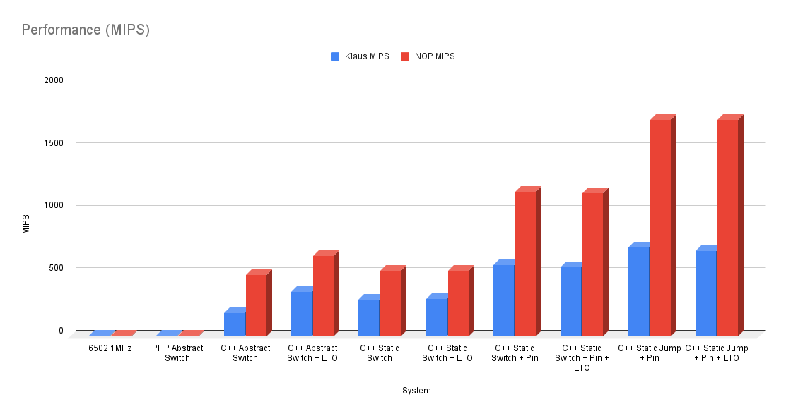
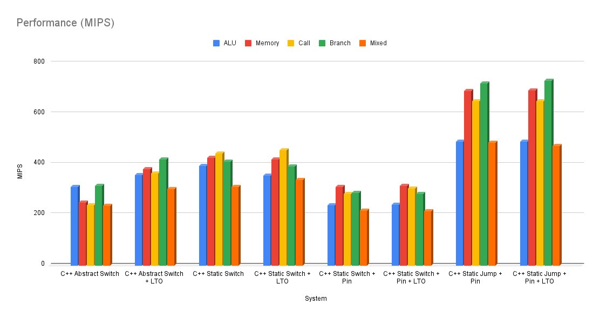

```
             | | | | | | | | | | | |
           +=^=^=^=^=^=^=^=^=^=^=^=^=+
           |  ┏━╸┏━┓┏━╸┏━┓┏━┓┏━┓┏━┓  |
           |  ┃  ┣━┓┗━┓┃┃┃┏━┛┣━┛┣━┛ C|
           |  ┗━╸┗━┛┗━┛┗━┛┗━╸╹  ╹    |
           +=v=v=v=v=v=v=v=v=v=v=v=v=+
             | | | | | | | | | | | |

            SixPhphive02 Goes Native!
```
# C6502PP
### The most unnecessary port of the world's least sensible 6502 emulator!

## What
A C++ implementation of [SixPhphive02](https://github.com/0xABADCAFE/sixphphive02)

- Compile Time Abstracted.
- Uses _templates_ and _concepts_ in place of runtime polymorphism and interfaces.
- Reaches hundreds of MIPS on modern hardware, depending on interpreter configuration and workload.

## Why?
Mainly a nerdsnipe, but also an excuse to play with a hypergolic mix of C++20 concepts and low-level dirty GCC-isms. You might be able to use the code in an emulator, but it does not yet have cycle exactness or support the set of known illegal opcodes. On the flip side, the emulation code is entirely header based and therefore should be simple to integrate.

## Building
You'll need a recentish GCC version, I have only tested with 11.4. I only write the most basic Makefiles, so I asked Gemini to write this one.

```bash
    :~/$ git clone https://github.com/0xABADCAFE/C6502PP.git

    :~/$ cd C6502PP/src
    :~/C6502PP/src$ make bench
```

This should produce the following binaries with and without link-time optimisations (LTO):

- `test_runtime`, `test_runtime_lto`
    - The most direct C++ port from the original PHP.
    - Uses traditional runtime polymorphic approach to abstraction.
    - Switch/case based instruction dispatch.

- `test_sc`, `test_sc_lto`
    - Initial conversion to compile-time abstraction.
    - Code is now entirely template based.

- `test_sc_pin`, `test_sc_pin_lto`
    - Adds local variable pinning of the program counter and memory dependency reference.

- `test_max`, `test_max_lto`
    - Conversion of switch/case to computed goto based threaded dispatch.

Each binary performs two tests:

- The fastest instruction throughput, based on execution long spans of NOP.
- A more typical case instruction throughput, based on running a diagnostic ROM.

Each test takes a few seconds to run and outputs the same data. For example:

```bash
    :~/C6502PP/src$ time ./test_max
    sizeof(CompileTimeSystem) = 65664 bytes
    PC: 0x0000 => 0x00
    SP: 0x01FF => 0x00
    A: 0x00 [   0]
    X: 0x00 [   0]
    Y: 0x00 [   0]
    F: [- - | - - - Z -]
    Ran 3276800000 0xEA insructions in 1891107632 nanoseconds [1732.741 MIPS]
    Loaded data/rom/diagnostic/6502_functional_test.bin
    Beginning execution from 0x0400
    Klaus Test Passed! Ran 306480490 insructions in 493651005 nanoseconds [620.844 MIPS]
    PC: 0x3469 => 0x4C
    SP: 0x01FF => 0x34
    A: 0xF0 [ -16]
    X: 0x0E [  14]
    Y: 0xFF [  -1]
    F: [N V | - - - - C]

    real	0m2.437s
    user	0m2.436s
    sys	0m0.000s
```

The initial and final state of the CPU emulator is shown, along with the nanosecond timing and implied performance. For the most reliable results you should run in the absence of other processes, with a fixed CPU speed (e.g. performance mode) and chain three successive executions together, eg.

```bash
    :~/C6502PP/src$ ./test_max && ./test_max && ./test_max
```
Generally the first cold run will have the least reliable timing, whereas the subsequent runs are closer together as other variances are reduced.

## Basic Results

Note: Benchmarks have been rerun since the original build to capture const correctness changes and additonal pinning that has dramatically improved the general performance in some cases.

From silicon to SixPhphive02 through to the four iterations of the C++ port, the data are given below. All emulation tests were performed on a 2018 i7-7500U running in performance mode at 3.5GHz.

**Peak NOP Throughput and Klaus Dormann**

| **System** | **Klaus Dormann** | **NOP** |
| ---: | ---: | ---: |
| PHP Abstract Switch | 3.07 | 4.3 |
| C++ Abstract Switch | 188 | 490 |
| C++ Abstract Switch + LTO | 350 |641 |
| C++ Static Switch | 293 | 523 |
| C++ Static Switch + LTO | 297 | 523 |
| C++ Static Switch + Pin | 567 | 1153 |
| C++ Static Switch + Pin + LTO | 552 | 1143 |
| **C++ Static Jump + Pin** | **705** | **1730** |
| C++ Static Jump + Pin + LTO | 682 | 1726 |


**Raising the bar (chart)**



The silicon and SixPhphive02 performance are completely insbisible at that scale, so charting again with a logarithmic scale:


## Reality Cheque, Please!

- Hitting **1730** MIPS at **3.5 GHz** is a throughput of one emulated NOP per two host clock cycles in a single-threaded workload.
- Since the complete size of the final NOP handler is six x64 instructions, this means three instructions retired per clock (assuming an even split).
- This is a testament to modern out-of-order, superscalar execution:
    - The i7-7500U (Kaby Lake) has a peak of four instructions per clock in a single thread.
    - Due to sequential data dependencies between successive instructions, hitting 3 out of 4 in parallel is the limit since the branch unit needs the result of the calcuation and can only retire one branch per cycle. There's no reordering that.
    - So, this is it, the _lightspeed_ solution... At least without cheating ;)

- A final thought: since the 6502 could execute a NOP every 2 cycles, we could say that (at least for NOP) we're hitting a 3.5GHz 6502 equivalent.


## Intuition Engine 6502 Benchmarks Port

This project includes an additional suite of 6502 benchmarks ported from [Zayn Otley's Intuition Engine](https://github.com/IntuitionAmiga/IntuitionEngine). These benchmarks provide a standardized workload to compare the performance of this C++ emulator against the original Go-based interpreter and JIT implementations.

### Ported Workloads

The following benchmark categories were extracted from the Intuition Engine's Go test suite:

*   **ALU:** Register-heavy arithmetic operations (ADC, AND, EOR, etc.) in a tight counted loop.
*   **Memory:** Zero-page load/store throughput testing memory bus efficiency.
*   **Call:** JSR/RTS subroutine overhead, measuring block-exit and stack performance.
*   **Branch:** Alternating taken/not-taken branch patterns to test pipeline/dispatch efficiency.
*   **Mixed:** A complex interleaved workload of ALU, memory, stack, and branch operations.

### Methodology
To ensure an "apples-to-apples" comparison with Go's `testing.B` harness, our C++ `bench_harness` implements the same execution model:
1.  **State Isolation:** All registers (`A`, `X`, `Y`, `SR`, `SP`) are reset using `softReset()` between every complete iteration of the benchmark loop.
2.  **Duration-Based:** Each benchmark runs for a fixed 30-second window to gather statistically significant throughput data.
3.  **MIPS Calculation:** Throughput is calculated as: `1.0e3 * total_instructions / nanoseconds`.
4.  **Production Wiring:** The harness uses the same `SystemType` selection as the main executable, so the `Runtime` benchmark exercises the same `RuntimeSystem<MOS6502, Bus::AbstractMemory>` path as `test_runtime`.

### Running the Suite
You can run the full cross-interpreter benchmark suite, comparing the `Runtime` baseline plus the four compile-time configurations, using the provided script:

```bash
    cd src && ./run_benchmarks.sh
```

For shorter smoke checks, you can override the default duration:

```bash
    cd src && BENCH_SECONDS=1 ./run_benchmarks.sh
```

The script compiles the harness for each interpreter variant and prints a consolidated five-row performance table.

### Running the Unified Interpreter Matrix

`run_all_interpreters.sh` is a single entry point that builds and benchmarks every interpreter variant this tree knows about against the same five workloads, and prints one sorted MIPS table. It covers three families of rows:

1. The 8 C++ interpreters from `benchmark_matrix.mk` (same build set as `run_benchmarks.sh`).
2. Two cpp->Go variants sourced from [IntuitionAmiga/G6502PP](https://github.com/IntuitionAmiga/G6502PP): `pinhot` (A, SR, PC, and the outside-memory pointer pinned to locals) and `pinall` (adds X/Y/S via `-DPIN_ALL`).
3. Up to three rows from prebuilt Go `testing.B` benchmarks: `Interpreter`, `JIT`, and - when `./6502_bench_goasm.test` is also present - `Interpreter_goasm`, a bench binary linked with the Goasm-fused interpreter path enabled.

```bash
    cd src && ./run_all_interpreters.sh
```

Every cell is MIPS over the same `.bin` workload and instr/op count, so rows compare directly. Rows are sorted ascending by the Mixed column, so the current fastest sits at the bottom of the table.

Knobs:

- `BENCH_SECONDS=N` - wall-clock seconds per C++ / CppGo cell (default 5).
- `BENCH_TIME=Ns` - `-test.benchtime` passed to the Go `testing.B` binaries (default matches `BENCH_SECONDS`).
- `BENCH_BIN=path` and `BENCH_BIN_GOASM=path` - override the two prebuilt Go bench binaries.
- `GOCPP_REPO=URL-or-path` - source for the CppGo_* rows. Defaults to the upstream URL and is shallow-cloned fresh each run. Setting it to a local checkout directory builds in-place, needs no `git`, and works offline. The CppGo_* rows are skipped when neither option is reachable.
- `RAW=1` - dump the raw `testing.B` output from each bench binary before the summary table.

### Intuition Engine Comparative Results (MIPS)

The following table is one sample local run of the current benchmark matrix on the same i7-7500 machine under the same test conditions. As always, exact numbers are machine and duration-dependent, so treat it as an example rather than a canonical ranking.

**Throughput per build**

| **Build** | **ALU** | **Memory** | **Call** | **Branch** | **Mixed** |
| ---: | ---: | ---: | ---: | ---: | ---: |
| C++ Abstract Switch | 313.39 | 248.80 | 236.20 | 314.21 |234.84 |
| C++ Abstract Switch + LTO | 347.27 | 379.58 | 364.34 | 417.90 | 306.05 |
| C++ Static Switch | 395.58 | 424.98 | 441.52 | 410.39 | 340.74 |
| C++ Static Switch + LTO | 393.08 | 416.06 | 453.65 | 384.27 | 336.92 |
| C++ Static Switch + Pin | 570.34 | 669.28 | 566.93 | 670.89 | 480.64 |
| C++ Static Switch + Pin + LTO | 558.52 | 670.31 | 616.83 | 662.60 | 448.32 |
| C++ Static Jump + Pin | 675.04 | 708.51 | 647.84 | 788.44 | 536.79 |
| C++ Static Jump + Pin + LTO | 676.73 | 709.43 | 651.05 | 792.48 | 536.72 |

Numbers above were taken from a `BENCH_SECONDS=1` smoke run to keep the example quick to reproduce. Use the default 30-second duration for more stable comparisons.

The source for these tests can be found in the [data](./data/) directory.

Charting those:



## A Journey

You don't have to read this, but I hope you enjoy the folly if you do. Strap in.

### Origin Story

In 2023 and _SixPhphive02_ was originally written for amusement and as an experiment in how you might go about such a thing in a language like PHP. The end result wasn't too bad and didn't stray too far away from good practise:

- There were interfaces that were incrementally extended and merged, e.g.
    - _IDevice_ that defined reset behaviours.
    - _IByteAccessible_ that defined read/write behaviours.
    - _IBusDevice_ union of _IDevice_ and _IByteAccessible_.
    - _IProcessor_ interface that extended _IDevice_ adding more specific behaviours for a CPU.

- There were concrete implementations, e.g.
    - A 6502 implementation of _IProcessor_ that implemented an interpreter loop that pulled the next instuction byte from the bus and a _switch/case_ to handle the it.
    - RAM and ROM implementations of _IBusDevice_
    - A PageMapped _IBusDevice_ that managed a collection of the other _IBusDevice_ instances that lived at different address, allowing a system of components to be assembled.
    - A Bus level debug adapter _IBusDevice_ that could intercept and log all IO because nothing says awesome quite like a 2GiB debug log from a 64KiB addressable system.

These were plumbed together using standard dependency injection:

- The CPU accepted an _IBusDevice_ implementation as a constructor dependency to keep things neatly decoupled.

As I was not in any way a 6502 expert, the famous [Klaus Dormann](https://github.com/Klaus2m5/6502_65C02_functional_tests) diagnostic ROM was used to validate the emulation was correct:

- This tests every legal opcode and deadends into various endless loops for failures.
- If all goes well, it deadends into an infinite loop at address 0x3469.

The handler for unconditional branch was designed to exit if a branch jumps back to itself, meaning that the test exits and the test verified by checking the program counter.

To test the performance, two benchmarks were ran:

- NOP was repeatedly executed in blocks of 32768 to get a baseline for what should be the fastest throughtput and the critical path.
- The Klaus Dormann diagnostic was ran to completion (30648049 instructions up to and including the unconditional branch at 0x3469) and timed.

Knowing the total instruction counts for each, on a 2018 i7-7500U @ 3.5GHz running PHP 8.1 (at the time) without JIT enabled:

- NOP peaked at **4.31 MIPS**
- Klaus Dormann diagnostic achieved **3.07 MIPS**

This was actually better than I expected and is significantly faster than the original 6502 is at 1 MHz:

- NOP takes 2 cycles, implying a **0.5 MIPS** peak.
- Real code is typically quoted at **~0.4 MIPS**.
- This tracks with the most commonly used instructions being 2-3 cycles.

### Today

It was an Easter weekend and I wanted to mess around with something nerdy but equally I didn't want the cognitive overhead of thinking _what_. So I thought I'd port SixPhphive02 to C++. This covers two of my favourite high level programming languagues.

### Attempt 1 : The Direct Port

The first port was a like-for-like reimplementation. I didn't port everything, just the CPU, a basic _AbstractMemory_ with a concrete implementation for a basic array of 65536 bytes. This was given as a dependency on construction, just like the original PHP version. Everything else was basically identical:

- The CPU class ran a loop that fetched the next instruction byte from the _AbstractMemory_ dependency
- A _switch/case_ was used to handle the instruction.
- All the same bitwise manipulation of the status register for flags.

The same basic benchmarks were ran on the same hardware under the same conditions:

- NOP peaked at **490 MIPS** (433 before const correctness updates)
- Klaus Dormann diagnostic achieved **186 MIPS** (178 MIPS before const correctness updates)

This was already a massive **114x** speedup over SixPhphive02 for the simplest operation and a **60x** speed up more generally.

Turning on _Link Time Optimisation_ made an equally impressive difference.

- NOP peaked at **641 MIPS** giving a 48% improvement with LTO.
- Klaus Dormann diagnostic achieved **350 MIPS** giving a 96% improvement with LTO.

When enabled, Link Time Optimisation defers the final round of optimisation to the linking stage, essentially allowing code that is properly isolated and encapsulated to be revealed. This allows the compiler to identify the real concrete code hiding behind the abstraction and peel away some of the indirection. In this case, the compiler can see that our virtual pointer is only ever assigned to one specific concrete implementation of the abstraction and is able to completely devirtualise the call. As such, this example serves as something of a best case example of what the technique can do.

### Attempt 2 : Static Shock

I should've called it, but what I really wanted to do was to try _compile time_ abstraction. The next iteration changed things:

- The CPU became a _template_ class that depended on another _template_ for the memory.
- The idea was that the required memory access methods should be inlineable and should be optimised away to the direct array accesses that the memory implementation actually uses.
- The source code still looks clean and properly separated by concern.

The same benchmarks were repeated:

- NOP peaked at **523 MIPS** giving a 21% improvement over the previous non-LTO version.
- Klaus Dormann diagnostic achieved **294 MIPS** giving a 65% improvement over the previous non-LTO version.

This was definitely a result supporting the compile-time over runtime abstraction argument. However it is worth noting that these results are slower than the previous iteration with LTO enabled.

Turning on LTO made very little difference here, primarily becasue the indirection it is able to unravel does not exist in the statically abstracted code.

### Attempt 3 : Put A Pin In It

I wanted to validate my assumptions about what was going on in the code and inspected the assembly:

- The original version relied on `call` for the virtual functions and it was clear this was all stripped away for direct array access in the new version.
- However, I did notice that the reference for the Memory implementation instance was being reloaded in every handler.

That surprised me because being such a hot reference you'd expect it to get put into a register. Equally hot was the emulated program counter. This was loaded from, modified and written back to the CPU data structure in every handler.

The real reason the compiler doesn't decide to cache these values somewhere faster is that it cannot gurantee they won't be changed by something else during the lifetime of the execution: any method call or concurrent activity could change the values leading to improper execution.

So I thought I might try and _pin_ it. _Pinning_ is a technique where you take some member value and put it into a local temporary that you use for the duration and finally write back to the member at the end.

Fortunately, shadowing the member values into local values within the main interpreter was quite easy thanks to C++'s scoping rules. If a local variable `my_value` has the same name as a member variable in the current method, the local declaration is used _unless_ the member variable is explicitly requested using `this->my_value`.

The only complication is that there were several helper methods that are called, which still use the the member variables. That is incompatible with the approach. Some light refactoring so that those helper methods became static and accepted the pinned variables as `const` parameters. This should allow the compiler to keep these values in registers when inlining those calls.

The compiler was still reluctant to trust the shadowed reference to the memory. The reason for this is that it needs a stronger guarantee that the pointer cannot change over the lifetime. Fortunately, there is a qualifier for exactly this purpose. Adding `__restrict__` to the declaration is a platinum promise to the compiler that you know what you are doing.

The same benchmarks were repeated:

- NOP peaked at **1153 MIPS** giving a 220% improvement over the previous iteration (was 869 before additonal pinning)
- Klaus Dormann diagnostic achieved **567 MIPS** giving a 91% improvement over the previous iteration (was 371 before additional pinning)

As with the previous iteration, enabling LTO did not have any meaningful effect without any abstractions to devirtualise.

### Attempt 4 : To Boldy Goto

Looking at the assembly language reminded me that _switch/case_ constructs are sometimes just not as fast as people like to think. Often a switch/case becomes a jump table of branch offsets, one per possible switch value, that is indexed by the value being switched. Each offset points to the code for a declared case, or to the default case. The code to perform the switch lookup and branch to the case handler is located in one place and the interpreter loop comes back to it every iteration.

Since I was compiling for 64-bit, the compiler was generating a jump table with 32-bit values. At 256 entries of 4 bytes each this uses 1KiB and funneling it all through a single dispatch location adds extra branching. So I decided to change that to use _computed goto_.

- This is a GCC extension that allows the address of a label to be taken and used as an indirect _goto_ destination:

    - The address of a label can be taken into a variable, e.g. `uint8_t const* target = (uint8_t const*)&&some_label_to_goto_later;`
    - Invoking that is just `goto *target;`
    - The interesting thing is that you can use regular pointer arithmetic to get the code distance between two labels:

        - Example, `size_t distance = ((uint8_t const*)&&later_label - (uint8_t const*)&&earlier_label);`
        - If the distances are certain to be small enough, you can use a narrower type.

- As the overall size of the executable was already around 32 KiB this got me thinking that I could construct an array of 16-bit offsets and this table would be half the size of the typical switch/case table.
    - A check on the table values revealed a maximum displacement of ~15K.

- Finally, the computed goto could be added at the end of each instruction handler to automatically determine where to go next, without branching backwards and forwards from the single dispatch location:
    - This approach is commonly known as _threaded dispatch_
    - Note, that's not _threaded_ as in concurrent, but as in to run a thread through something.

#### Insane in the domain...

Doing this without radically having to rewrite everything was solved using a set of regular preprocessor macros that generate either the regular switch/case logic or the new computed goto, depending on build flags. This formed a new domain language for writing handlers:

```
        begin() {
            handle(LDA_IM) {
                // updateNZ is static and takes reference parameters to iStatus
                // to facilitate pinned and unpinned compilation.
                updateNZ(iStatus, iAccumulator = load(iProgramCounter + 1));
                size(LDA_IM);
                dispatch();
            }

            handle(LDA_ZP) {
                updateNZ(iStatus, iAccumulator = load(addrZeroPageByte()));
                size(LDA_ZP);
                dispatch();
            }

            // Big snip...

            illegal();
        }

```

For the switch/case model, this produces:
```C++
        // Forever
        for (;;) switch (oOutside.readByte(iProgramCounter)) {
            case LDA_IM: {
                updateNZ(iStatus, iAccumulator = oOutside.readByte(iProgramCounter + 1));
                iProgramCounter += SIZE_LDA_IM;
                break;
            }

            case LDA_ZP: {
                updateNZ(iStatus, iAccumulator = oOutside.readByte(addrZeroPageByte()));
                iProgramCounter += SIZE_LDA_ZP;
                break;
            }

            // One mass of cases later...

            default:
                return;
        }
```
For the computed goto model, something rather different:

```C++
        // Risky narrow 16-bit jump offsets - what if the distance ever gets bigger than 65536?
        static uint16_t const aJumpTable[256] = {
            (uint16_t) ((uint8_t const*)&&L_BRK - (uint8_t const*)&&begin_interpreter),
            (uint16_t) ((uint8_t const*)&&L_ORA_IX - (uint8_t const*)&&begin_interpreter),
            (uint16_t) ((uint8_t const*)&&L_BAD - (uint8_t const*)&&begin_interpreter), // No legal opcode 0x02
            // ...
            (uint16_t) ((uint8_t const*)&&L_BAD - (uint8_t const*)&&begin_interpreter), // No legal opcode 0xFF
        };

        // Here be gotos...

        begin_interpreter:
            // To dispatch, add the offset for the current opcode onto this base label address to reconstruct the target label address.
            goto *((uint8_t const*)&&begin_interpreter + aJumpTable[oOutside.readByte(iProgramCounter)]);
        {
            // We stay in this block, jumping from label to label, until something causes us to leave.
            L_LDA_IM: {
                updateNZ(iStatus, iAccumulator = oOutside.readByte(iProgramCounter + 1));
                iProgramCounter += SIZE_LDA_IM;

                // Jump straight to the next handler...
                goto *((uint8_t const*)&&begin_interpreter + aJumpTable[oOutside.readByte(iProgramCounter)]);
            }

            L_LDA_ZP: {
                updateNZ(iStatus, iAccumulator = oOutside.readByte(addrZeroPageByte()));
                iProgramCounter += SIZE_LDA_ZP;

                // Jump straight to the next handler...
                goto *((uint8_t const*)&&begin_interpreter + aJumpTable[oOutside.readByte(iProgramCounter)]);
            }

            // More labels than a fashion victim later...

            L_BAD:
                // Nothing to do here, we fall out of this block and we are done.
        }
```

All that said, only the numbers matter. The same benchmarks were repeated:

- NOP peaked at **1730 MIPS** giving a 50% improvement than the previous iteration.
- Klaus Dormann achived **705 MIPS** giving a 25% increase over the previous iteration (was 621 MIPS before additional pinning).

Turning on LTO for this build actually had a detrimental effect, costing a few percent on each metric. My assumption is that attempting to optimise the code globally makes the set of registers available within the interpreter loop smaller, increasing pressure there.

### Attempt 5: Lessons from the Frankengo Experiment: More pins, please.

Recently I ported the work to a [Frankenstein's monster](https://github.com/0xABADCAFE/G6502PP/tree/main) of the CPP macros and Go, just to see what would happen. Since Go doesn't really have a function inline guarantee, I ended up converting quite a few of the helper functions to macros. More than that, though, the complete set of 6502 registers were pinned to local variables. Not particularly because I had intended to, but because it was just easier to work that way.

The result, however, was that for the basic switch case model was hitting 450 MIPS in the Klaus Dormann tests, compared to the 371 MIPS of the C++ version. I suspected that with all other things being approximately equal, the difference must be due to the additional pinning since both the accumulator and status register are very hot. So I set about fixing it.

- All inline helper functions were made `static` and accept the `iStatus` and `iAccumulator` registers as reference parameters.
- Additional const correctness checks put in place to make sure the compiler understood if a reference parameter would be unchanged.

These changes had a significant impact on the versions that use pinning, but equally improved some of the others since the move to references likely increased the duration of register caching of values in more complex operations.

- For the switch/case, register pinned build, the Klaus Dormann throughput increased from 371 to 567 MIPS, an increase of 53%.
- More surprisingly, even the peak NOP throughput increased from 869 to 1153 MIPS, an increase of 33%.

Most importantly, of course, the C++ version was now faster than the abused gopher one:

- 26% faster Klaus Dormann execution than the equivalent Go build.
- 35% faster (1153 vs 856) peak NOP throughput than the equivalent Go build.

At this juncture, both builds are using a switch/case interpreter with code that is as inline as possible and hopefully comparable register allocation for the pinned values. The Go build was also designed to bypass all bounds checking for the memory accesses and avoid anything that might result in garbage collection cycles during execution.

- The remaining differnces are likely down to the maturity of the compiler and the extra tuning parameters availabe to GCC rather than any specific deficiency of Go as a language.

**Eternal Noptimist: Evolution of a NOP handler:**

Given all this, what does our minimal opcode fetch/execute/disatch code _actually_ look like through this journey?

**Version 1**

```asm

.L19: ; Handler for NOP

    ; Notes
    ;
    ; Due to using a static instance of the CPU class, the compiler is using position independent code references to
    ; the CPU data via displacement(%rip) addressing.
    ; The address of generated jump table is already held in %rbx here.

    incw    32+_ZZ4mainE6system(%rip) ; Incrementing the 16-bit member program counter is all NOP does
    jmp     .L5                       ; Jump to the common dispatch logic

    ; Many lines of code later...

.L5:
    ; Common dispatch logic here
    movq    16+_ZZ4mainE6system(%rip), %rdi ; Load up the pointer to the memory implementation
    movzwl  32+_ZZ4mainE6system(%rip), %esi ; Load up the 16-bit member program counter for the readByte() call parameter
    movq    (%rdi), %rax                    ; Get the memory virtual function table
    call    *32(%rax)                       ; Virtual function call to the memory.readByte()

    cmpb    $-2, %al                        ; Range check optimisation, skip all values beyond max defined case
    ja      .L510                           ; Early out to default handler


    movzbl  %al, %eax                       ; Zero extend the instruction byte
    movslq  (%rbx,%rax,4), %rax             ; Look up the displacement value
    addq    %rbx, %rax                      ; Add displacement
    jmp     *%rax                           ; Jump to handler

    ; switch/case jump table
    .section    .rodata                     ; Located in read only section, potentially far away from here.
    .align 4
    .align 4

.L8:
    ; The generated switch case table
    ; Notice each entry is .long, which is a 32-bit value.
    .long   .L158-.L8 ; specific case
    .long   .L157-.L8 ; specific case
    .long   .L510-.L8 ; default case
    .long   .L510-.L8 ; default case
    ; all the other cases
```

That's quite a lot of work, but the compiler has made an optimisation to the jump table by early identifying some unreachable targets and going directly to the default case.

**Version 2**

Elimination of indirection.

```asm
.L33: ; Handler for NOP

    ; Notes
    ;
    ; The compiler has changes register assignment and the address of generated jump table is now held in %rsi
    ; Structural changes have moved offests to member variables.

    incw    16+_ZZ4mainE6system(%rip)       ; Incrementing the 16-bit member program counter.
    jmp     .L19                            ; Jump to the dispatch logic

    ; many lines of code later...

.L19: ; next instruction fetch has been moved
    movq    (%rcx), %rdx                    ; Get the raw memory pointer
    movzwl  16+_ZZ4mainE6system(%rip), %eax ; Get the displacement of the byte in memory
    cmpb    $-2, (%rdx,%rax)                ; Range check on byte in memory
    jbe     .L525                           ; Only continue with instruction decode if case is in range. Note the flip.

    popq    %rbx                            ; We had a bad opcode so restore call stack and ...
    ret                                     ; ... exit interpreter

    ; Many lines later ...

.L525:
    movzbl  (%rdx,%rax), %eax    ; load the instruction byte, hot now due to check.
    movslq  (%rsi,%rax,4), %rax  ; get the corresponsing jump table record
    addq    %rsi, %rax           ; compute jump ...
    jmp     *%rax                ; ... and go

    ; Same arrangement for the switch/case table
    .section    .rodata
    .align 4
    .align 4
.L22:
    .long   .L172-.L22
    .long   .L171-.L22
    .long   .L521-.L22
    ; ...
```

What is most evident here is the expected lack of virtual function calls. Access to the memory of the static abstraction is now direct array access.

**Version 3**

Value pinning.

```asm
.L33: ; Handler for NOP

    ; Notes
    ;
    ; Memory reference and 16-bit program counter are no longer structure member values and have been shadowed
    ; into local variables.
    ; The 16-bit program counter now lives in %eax

    incl    %eax                ; Increment the 16-bit program counter. Even though long, %ax uses only the low 16 bits.
    jmp     .L19                ; Jump to hander.

    ; Many lines later...

.L19:
    movzwl  %ax, %ecx           ; Zero extend the 16-bt value
    cmpb    $-2, (%rdx,%rcx)    ; Same range check
    jbe    .L529

.L525:
    ; Early exit. Note that due to increased register allocation, there's more state to restore.
    popq    %rbx
    popq    %rbp
    ret

.L529:
    ; Common dispatch, now completely register bound.
    movzbl  (%rdx,%rcx), %ecx
    movslq  (%rsi,%rcx,4), %rcx
    addq    %rsi, %rcx
    jmp     *%rcx

    ; Same jump table
    .section    .rodata
    .align 4
    .align 4
.L22:
    .long   .L172-.L22
    .long   .L171-.L22
    ; ... remaining cases
```

After this, it's obvious that the NOP itself is as small as it can be and the dispatching logic is the limit.

**Version 4**

Computed goto and threaded dispatch.

```asm
        ; Handler for the NOP instruction

        ; Notes
        ; We still have the memory and 16-bit program counters register allocated.
        ; %ax contains the 16-bit program counter
        ; %rsi contains the address of the base label.
        ; %rdi contains the address of the 16-bit jump table

        incl    %eax                ; Increment the pinned program counter
        movzwl  %ax, %edx           ; Dispatch:
        movzbl  (%rcx,%rdx), %edx   ;    Read the opcode at the new program counter location
        movzwl  (%rdi,%rdx,2), %edx ;    Load the 16-bit jump offset
        addq    %rsi, %rdx          ;    Add to the label base and...
        jmp     *%rdx               ;    ...off we go

```

6 instructions, of which the last five are just the dispatch. Without pinning the program counter, the first instruction becomes a load/modify/store cycle that introduces stalls when called too quickly. This explains why pinning had such a dramatic impact.

The jump table format is slightly different due to C++ type punning but it evaluates to the expected array of 16-bit values, located in the code startup section, rather than in constant data.

**Rigging it**

We can actually cheat with the NOP test by checking if the next opcode is NOP and keep incrementing until it isn't:

```
    handle(NOP) {
        while(NOP == oOutside.readByte(iProgramCounter))
            size(NOP);
            dispatch();
    }

```
- This brought the peak NOP result up to an eye watering **3055 MIPS** but as this completely circumvents the mechanism being tested, the changs is excluded from the codebase.

## Tidying Up

Understandably the code was a bit of a mess by now so in order to bring some sanity to all the templating, I decided to try C++20 _concepts_ to bring it together by reintroducing the basic ideas that _interfaces_ were used to solve in the first versions. Finally the original interfaces for the abstract memory were updated to be template substitutable within the broader compile-time abstracted model.

```C++

    /**
     * Device
     *
     * Has soft and hard reset behaviours
     */
    template<typename T>
    concept Device = requires(T t) {
        { t.softReset() } noexcept -> std::same_as<T&>; // Fluent
        { t.hardReset() } noexcept -> std::same_as<T&>; // Fluent
    };

    /**
     * ByteAccessible
     *
     * Defines basic 8-bit 16-bit addressable IO
     */
    template<typename T>
    concept ByteAccessible = requires(T t, Address address, Byte value) {
        { t.readByte(address) } noexcept -> std::convertible_to<Byte>;
        { t.writeByte(address, value) } noexcept -> std::convertible_to<void>;
    };

    /**
     * BusDevice
     *
     * Something that is both a Device and ByteAccessible
     */
    template<typename T>
    concept BusDevice = Device<T> && ByteAccessible<T>;

    /**
     * Processor
     *
     * Defines Device with constructor dependency on BusDevice.
     */
    template<typename D, typename B>
    concept Processor = Device<D> && BusDevice<B> && std::constructible_from<D, B&> && requires(D d, Address address) {
        { d.setProgramCounter(address) } noexcept -> std::same_as<D&>; // Fluent
        { d.getProgramCounter() } noexcept -> std::same_as<Address>;
        { d.run() } noexcept -> std::same_as<D&>; // Fluent
    };


    /**
     * CompileTimeSystem<Processor, BusDevice>
     *
     * Wraps an instance of a given Processor concept and BusDevice concept such that code generator is
     * able to inine away the read/write calls to the bus implementation.
     */
    template <
        template <typename> typename CPUType, // This is still not the most intuitive syntax, is it?
        BusDevice MemoryBus
    >
    struct CompileTimeSystem {

        using CPU = CPUType<MemoryBus>;

        CPU oCPU;
        MemoryBus oBus; // Embedded adjacent, meaning the internal array is hyper local to the CPU members too.

        CompileTimeSystem() : oCPU(oBus) {
            // Ensure the CPU is constructed with the Bus
            // We promise not to call any MemoryBus operations from the CPU constructor as it's not initialised yet.
        }

        CompileTimeSystem& run() {
            oCPU.run();
            return *this;
        }

        CompileTimeSystem& runFrom(Address iStart) {
            oCPU.setProgramCounter(iStart).run();
            return *this;
        }

        CompileTimeSystem& softReset() noexcept {
            oCPU.softReset();
            oBus.softReset();
            return *this;
        }

        CompileTimeSystem& hardReset() noexcept {
            oCPU.hardReset();
            oBus.hardReset();
            return *this;
        }
    };
```

The _CompileTimeSystem_ configuration is sometimes referred the _Motherboard Pattern_ in emulation circles. In our case, it means that when the compiler synthesises the CPU code and it sees lots of calls to oOutside.readByte() and friends, those calls are mapped directly to the SimpleMemory dependency and the compiler can simply optimse them away completely allowing the generated code to direclty access the array.

Contrast this to the standard OOP methodology in which the BusDevice would be some abstract class with concrete realisations. In that model, it is likely that readByte() etc. are virtual functions and as good as impossible to inline within the CPU code. A typical virtual function has a double indirection (virtual table access followed by getting the pointer in the table to the implementation code of the method).

Here we are taking a bet that we don't want a runtime configured System but even if there were several to choose from, we can stamp them out at compile time and simply choose the one to use at runtime, all without ever taking the runtime virtual call hit.

## Other Tweaks

For clarity, some tweaks are not shown here.

- Case and Label handlers use the C++ `asm("<text>")` construct to embed a comment into the generated assembler to assist manual inspection.
- All structures are declared using `alignas(<size>)` to ensure that they are aligned on a cache line boundary.
    - Uses `std::hardware_destructive_interference_size` if available or assumes 64, if not.

- The jump table uses a `Jump` type, which is conditionally aliased as either `uint16_t` or `uint32_t`:
    - It is not certain that a given target, e.g. ARM, will generate compact enough code to fit within a 16-bit jump range.
    - Even with a 32-bit wide table, the other benefits of threaded dispatch still apply.

- The main `run()` method that embeds the interpreter has the gcc `__attribute__((hot))` to ensure that the compiler knows to make aggressive optimisation choices within.
- The jump table has the gcc `__attribute__((section(".text")))` to ensure that it is allocated in the code (as opposed to data) section, adjacent to where it is used.
- For x64, control flow checks are disabled using `-fcf-protection=none` which prevents the emission of a special branch target instruction:
    - Functionally equivalent to a nop, this is added at the beginning of each label which adds a slight overhead.
    - Normally this security feature is used to validate that the branch instruction has hit a legal destination, triggering a trap otherwise.

- All branch labels are aligned using `-falign-labels=16` which helps the CPU's fetch instruction mechanism when branching.

## Further Work

To improve the throughput further, pinning further hot member variables is an obvious idea but it's also going to reduce the set of registers available to the optimiser for other purposes.

I also attempted a lazy-flags approach. For almost every instruction, the status register has to be updated which involves a fair amount of bitwise manipulation. Instead, I tried copying the result of the last operation to a local temporary that can be used to evaluate the N and V flags at the point where they first become necessary, i.e. on a conditional branch. This ultimately proved detrimental to performance but it might be the case that it can be revisited.

As a proof point that the interpreter plane still has headroom, see the Goasm-fused 6502 path in [Intuition Engine](https://github.com/IntuitionAmiga/IntuitionEngine) - the `Interpreter_goasm` row produced by `run_all_interpreters.sh`. With handwritten amd64 assembly for the hot dispatch it currently tops the unified matrix by a wide margin on Mixed, outperforming both the Go JIT and the fastest C++ variant in this tree - a useful reminder that a well-tuned interpreter can push further before a JIT becomes strictly necessary.

Cycle exactness and known illegal instructions are desirable features to add if the emulator is ever going to be more than an educational exercise.
